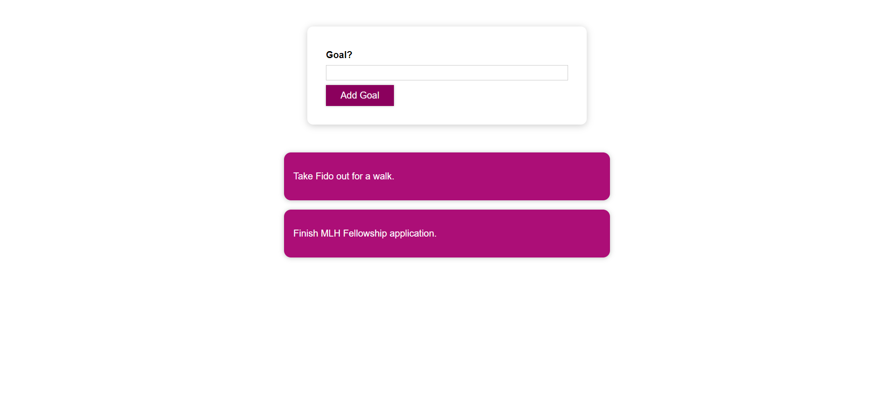

## to-do

An application used to manage a to-do list, built with React.

----

## Project Screen Shot(s)

----

## Installation and Setup Instructions

Clone this repository. You will need `node` and `npm` installed globally on your machine.  

**Installation:**

`npm install`    

To Start Server:

`npm start`  

To Visit App:

`localhost:3000/`  

----

This was the first project I sought to build using React. The goals I had in mind were to familiarise myself more with web development, and learn more technologies and concepts relating to it.

I started this process by using the `create-react-app` boilerplate, and then installing some packages. 

One of the main challenges I ran into was understanding how states work, and how and when to use them. However, during the course of this project, I believe that I have developed a fair understanding of the same. A really interesting thing I came across while building this project was CSS modules. I had seen people use Styled Components in the past, but using CSS modules is just a lot simpler and easier to the eyes.

At the end of the day, the technologies implemented in this project are React, JSX and CSS I chose to use the `create-react-app` boilerplate to minimize the time that goes into the initial setup.